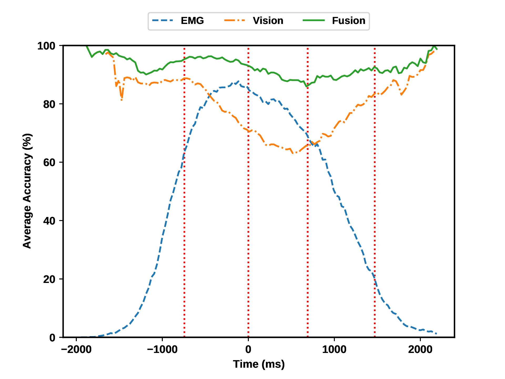

## Multimodal Evidence Fusion for Robust Grasp Intent Inference

**Objective:**  
For transradial amputees, robotic prosthetic hands hold the promise of restoring the ability to perform daily living activities. Current control methods based on physiological signals such as electromyography (EMG) often yield poor inference outcomes due to motion artifacts, muscle fatigue, and other noise sources.  
Vision sensors, on the other hand, provide rich contextual information about the environment and can play a key role in inferring feasible and intended gestures. However, visual evidence is also susceptible to artifacts such as object occlusion and lighting variation.  
Fusing multiple modalities—physiological and visual—is therefore a natural solution, leveraging the complementary strengths of each.

**Methods:**  
We present a **Bayesian evidence fusion framework** for grasp intent inference using **eye-view video**, **eye-gaze**, and **forearm EMG** signals processed through neural network models.  
We analyze both individual and fused performance as a function of time as the hand approaches the object to grasp it. To enable this, we developed novel data processing and augmentation techniques to effectively train the neural network components.

**Results:**  
On average, fusion improves instantaneous upcoming grasp-type classification accuracy during the reaching phase by **13.66%** and **14.8%** relative to EMG (**81.64% non-fused**) and visual evidence (**80.5% non-fused**) individually, achieving an overall **fusion accuracy of 95.3%**.

  
*Figure: Comparative accuracy of EMG, visual, and fused modalities during different phases.*

**Conclusion:**  
Our analyses demonstrate that EMG and visual evidence provide complementary information. As a result, **multimodal evidence fusion** outperforms each individual modality across all time frames, offering a more robust and reliable grasp intent inference for prosthetic hand control.

---

### Key Contributions

- **Data Collection:** Led and organized the collection of imagery and physiological data from multiple human subjects, coordinating a team of graduate researchers for prosthetic hand studies.  
- **Visual Modality:** Fine-tuned **YOLO** on **HANDSv2** 2D imagery using **Darknet**, achieving **80.5% accuracy** in grasp-type detection.  
- **EMG Modality:** Applied the **Extra Trees** method on **HANDSv2** 1D EMG signals to generate grasp-type probability vectors with **81.6% accuracy**.  
- **Fusion:** Demonstrated that EMG and visual evidence exhibit complementary strengths, improving performance by **13.66%** over individual modalities. Deployed the fused system on an embedded robotic prosthetic hand using **ROS** for real-time inference.  
- **Skills:** Leadership · Data Collection · Python · C++ · ROS · Darknet  
- **Publications:** *Frontiers in AI and Robotics (2024)* · *Frontiers in Neuroscience (2022)* · *EMBC (2021)*  
- **Awards:** *Best Paper of 2024 Award*
