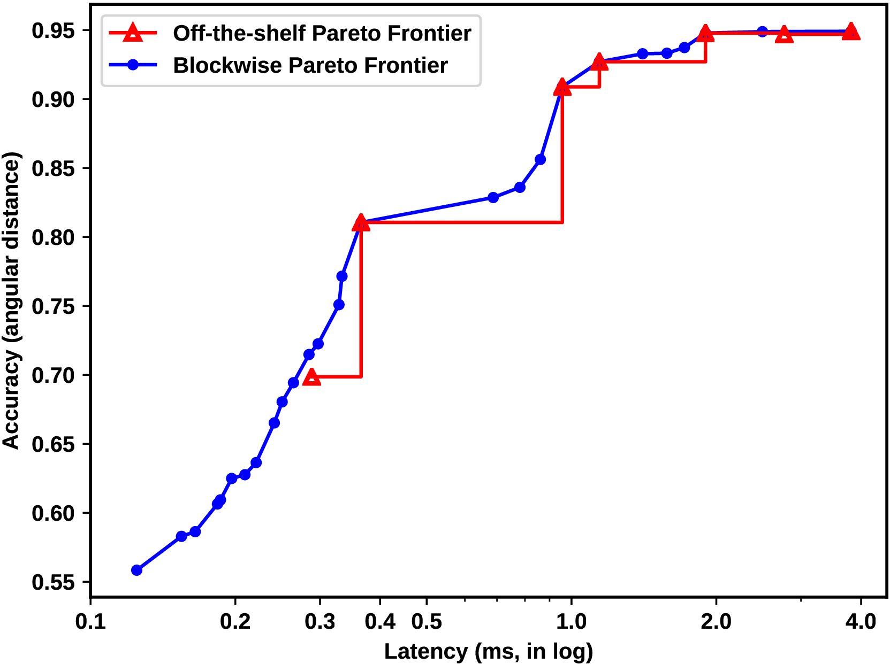

### NetCut & TRimmed Networks (TRNs)

Deep learning is increasingly integral to assisting humans across diverse domains, yet deploying these models on embedded systems poses steep challenges. When neural networks grow deeper to increase accuracy, they incur greater inference latency—especially problematic for resource-constrained processors with strict real-time deadlines. Often, this results in models that merely satisfy timing constraints while leaving unused slack time that could have been leveraged to improve accuracy.

In this work, we introduce two key advances:

1. **TRimmed Networks (TRNs)** — a layer-removal strategy that prunes problem-specific features from a pretrained network (via transfer learning), enabling the model to better fit simpler target tasks while reducing latency.  
2. **NetCut** — a deadline-aware methodology that uses empirical or analytical latency estimators to identify and retrain only those TRNs that can meet a given deadline—dramatically reducing exploration time.

We show that TRNs expand the accuracy-vs-latency Pareto frontier. In our experiments (on a prosthetic-hand inference task), TRNs combined with NetCut achieved up to **10.43% relative accuracy improvement** compared with standard off-the-shelf networks, while reducing network exploration time by **27×**.

**Skills:** Python • Keras • scikit-learn • HPC (Discovery Cluster)  
**Publication:** *Design, Automation & Test in Europe (DATE 2021)*.

<!--more-->
